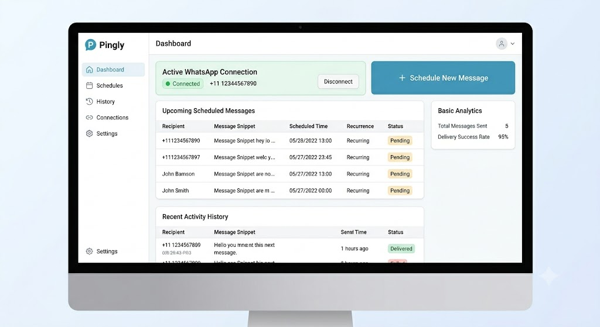
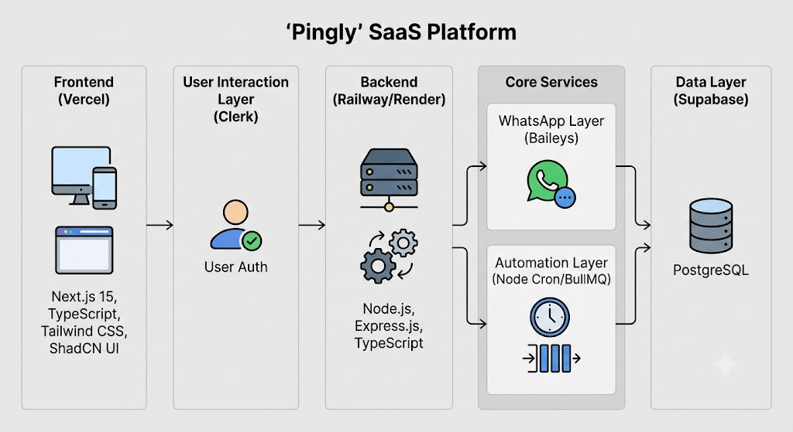
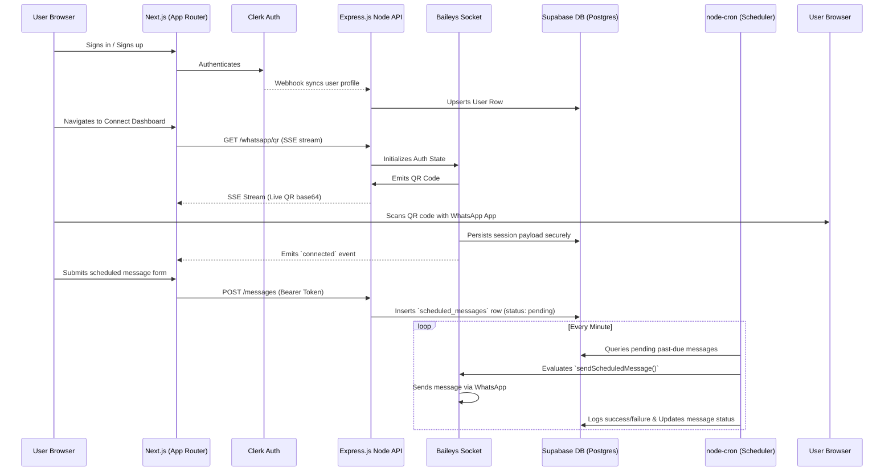
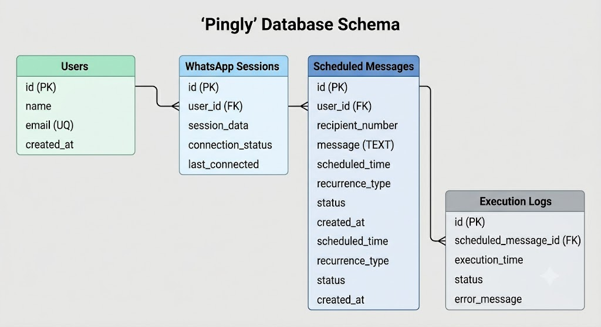
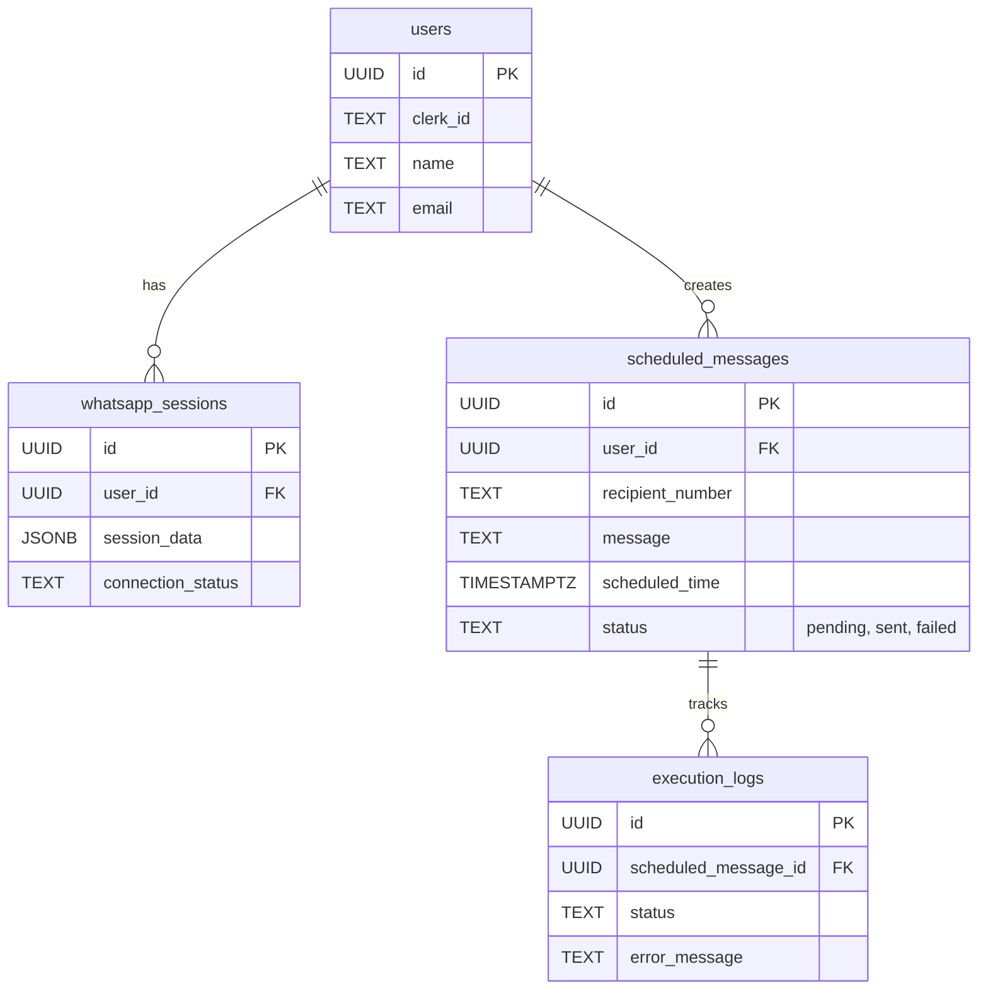
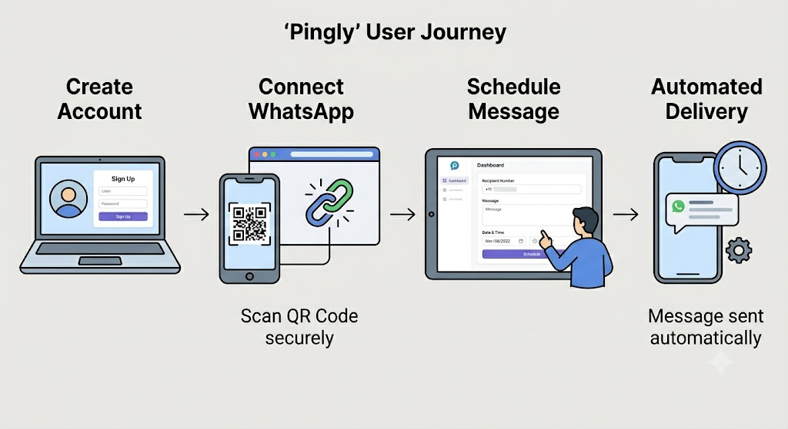

# 💬 Pingly: WhatsApp Automation SaaS

> Secure, precise, and automated WhatsApp messaging for everyone. Schedule reminders, follow-ups, and recurring messages with zero hassle.



## ✨ Overview

Pingly is a full-stack SaaS platform designed to eliminate the mental burden of remembering to send messages at specific times. By securely linking your WhatsApp session via QR code, Pingly allows you to easily compose and schedule messages down to the minute. 

Whether you're a student keeping track of group assignments, an individual sending birthday wishes, or a small business managing customer follow-ups—Pingly handles the delivery automatically.

## 🚀 Key Features

* **Quick Setup:** Connect your WhatsApp instantly by a simple scan.
* **Persistent Sessions:** Your connection stays alive and is securely managed on our backend.
* **Granular Scheduling:** Fire one-time or recurring messages exactly when you want.
* **Detailed History Logs:** Keep track of what was sent, when it was sent, and its success status via the dashboard.
* **Modern Aesthetic:** Built with a beautiful, responsive dark-mode SaaS UI out of the box.

---

## 🏗️ Technical Architecture

Pingly operates via a dual-node architecture splitting the responsive frontend from the heavyweight WhatsApp session runner and cron scheduler.

### 1. Unified Flow Diagram



### 2. Tech Stack Breakdown

#### Frontend Layer (`/Frontend`)
- **Next.js 15**: Application framework using App Router.
- **Tailwind CSS v4 + shadcn/ui**: Component and styling engine, configured with a custom WhatsApp Green design system (`globals.css`).
- **Clerk**: Comprehensive React authentication components and route protection (`middleware.ts`).

#### Backend Layer (`/Backend`)
- **Express.js (Node)**: API request handler and WebSocket streamer.
- **Supabase**: PostgreSQL database handling relations for users, configs, and message histories.
- **Baileys (@whiskeysockets/baileys)**: Headless WhatsApp Core. Fully custom integrated (`useSupabaseAuthState`) to use database blobs rather than the filesystem to allow scale in stateless deployment models (like Vercel/Railway).
- **node-cron**: Task runner that evaluates the outbox queue every minute.

---

## 🛠️ Data Modeling



---

## 💻 Getting Started

This repository contains two sub-projects that need to run concurrently.

### Prerequisites
1. Setup a project in [Supabase](https://supabase.com).
2. Setup a project in [Clerk](https://clerk.com).
3. Ensure Node.js v20+ is installed.

### 1. Database Initialization
Copy the SQL from `Backend/supabase_schema.sql` and run it in your Supabase SQL Editor to initialize all necessary tables and relations.

### 2. Backend Setup
Navigate to the `Backend` directory, configure your variables, and run the API.
```bash
cd Backend
npm install

# Create .env based on the required vars
# SUPABASE_URL=...
# SUPABASE_SERVICE_ROLE_KEY=...
# CLERK_WEBHOOK_SECRET=...

npm run dev
```

### 3. Frontend Setup
Navigate to the `Frontend` directory in a new terminal, configure your variables, and start the app.
```bash
cd Frontend
npm install

# Create .env.local 
# NEXT_PUBLIC_CLERK_PUBLISHABLE_KEY=...
# CLERK_SECRET_KEY=...
# NEXT_PUBLIC_API_URL=http://localhost:3001

npm run dev
```

Your app will be available on **http://localhost:3000**. Navigate here to create your account and scan your QR code!
